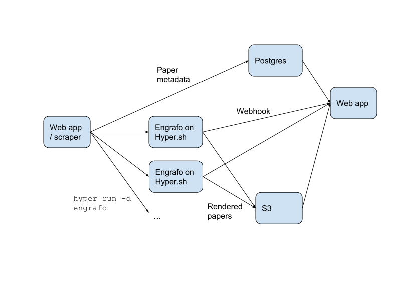

# Arxiv Vanity

[Arxiv Vanity](https://www.arxiv-vanity.com) renders papers from [Arxiv](https://arxiv.org) as responsive web pages so you don't have to squint at a PDF.

## Design

Arxiv Vanity downloads LaTeX source from Arxiv and renders it as HTML using the [Engrafo](https://github.com/arxiv-vanity/engrafo) LaTeX to HTML convertor.

The web app runs render jobs on [Hyper.sh](https://hyper.sh/) as Docker containers, and they report their status directly back to the web app with a webhook. This approach has two neat properties:

1. It effectively scales infinitely
2. There is no worker process or message queue

The process looks a bit like this:

In detail:

1. Details about the paper are fetched from the [Arxiv API](https://arxiv.org/help/api/index). Metadata is stored in a Postgres database using Django's ORM, and the paper's LaTeX source is stored on S3.
2. Engrafo is run on Hyper.sh to convert the LaTeX source to HTML. It fetches the source and stores the result on S3. The container ID is stored in the Postgres database so the status of the rendering job can be queried.
3. When the rendering job is finished, the Hyper.sh container makes an HTTP request to the web app to mark it as rendered.

## Running in development

Install Docker for Mac or Windows.

Do the initial database migration and set up a user:

    $ script/manage migrate
    $ script/manage createsuperuser

Then to run the app:

    $ docker-compose up --build

Your app is now available at [http://localhost:8000](http://localhost:8000). The admin interface is at [http://localhost:8000/admin/](http://localhost:8000/admin/).

You can scrape the latest papers from Arxiv by running:

    $ script/manage scrape_papers

It'll probably fetch quite a lot, so hit `ctrl-C` when you've got enough.

## Running tests

    $ script/test
