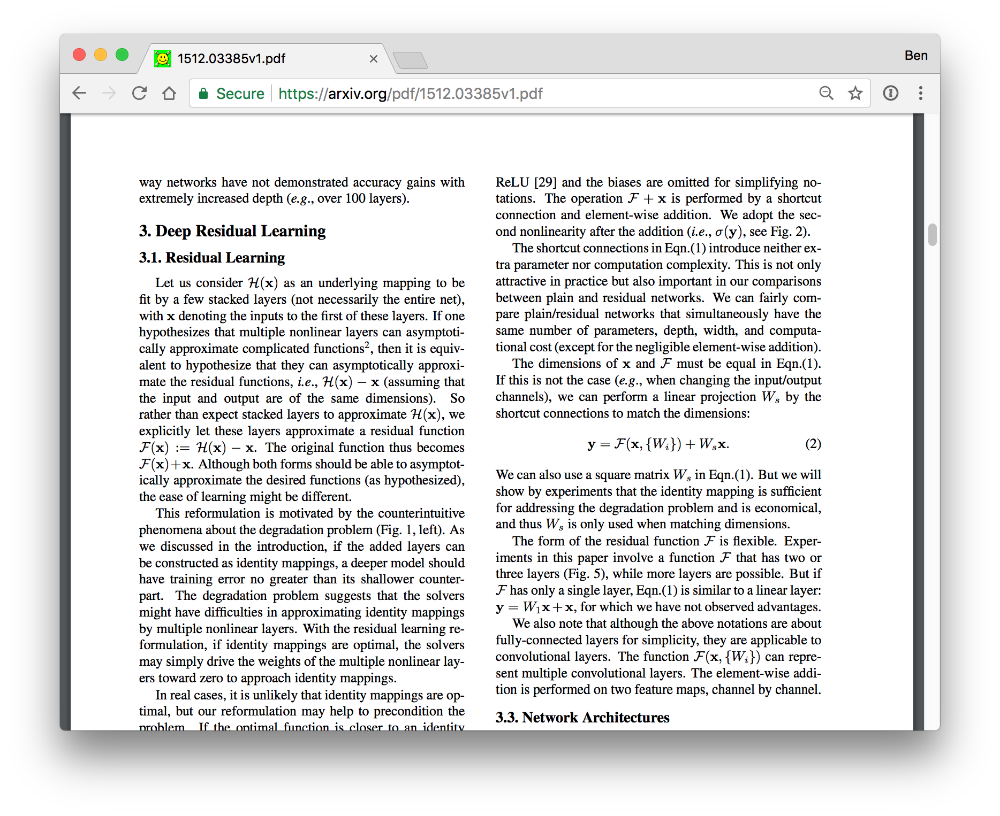
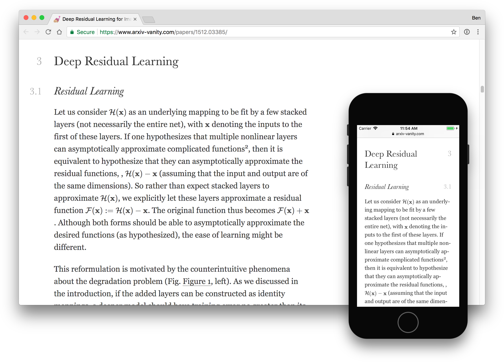

# arXiv Vanity

[arXiv Vanity](https://www.arxiv-vanity.com) renders papers from [arXiv](https://arxiv.org) as responsive web pages so you don't have to squint at a PDF.

It turns this sort of thing:



Into this:



This is the web interface for viewing papers. The actual LaTeX to HTML conversion (the interesting bit) is done by [Engrafo](https://github.com/arxiv-vanity/engrafo).

## Running in development

Install Docker for Mac or Windows.

Do the initial database migration and set up a user:

    $ script/manage migrate
    $ script/manage createsuperuser

Pull the Engrafo Docker image, which is needed for rendering papers:

    $ docker pull arxivvanity/engrafo

Then to run the app:

    $ docker-compose up --build

Your app is now available at [http://localhost:8000](http://localhost:8000). The admin interface is at [http://localhost:8000/admin/](http://localhost:8000/admin/).

You can scrape the latest papers from arXiv by running:

    $ script/manage scrape_papers

It'll probably fetch quite a lot, so hit `ctrl-C` when you've got enough.

## Running tests

    $ script/test

## Using a development version of Engrafo

[Engrafo](https://github.com/arxiv-vanity/engrafo) is the LaTeX to HTML converter. If you are working on Engrafo, you might want to use the version you are working on locally.

To do that, run `script/docker-build` in your local Engrafo directory. This will create an image called `engrafo-dev`.

Then, in the arXiv Vanity directory (the same one this readme is in), create a file called `.env` to tell arXiv Vanity to use that image to render papers:

```
ENGRAFO_IMAGE=engrafo-dev
```

## Sponsors

Thanks to our generous sponsors for supporting the development of arXiv Vanity! [Sponsor us to get your logo here.](https://www.patreon.com/arxivvanity)

[](https://www.yld.io/)
